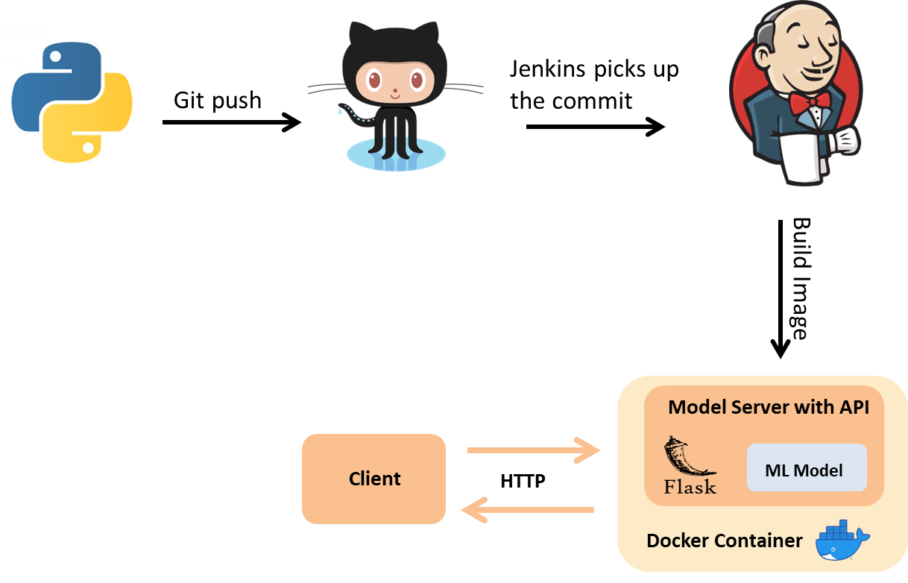
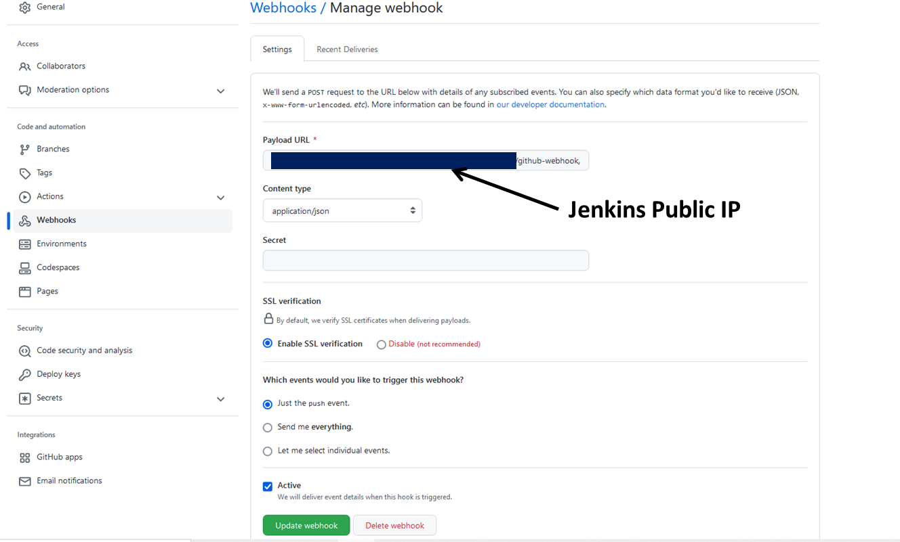

# Automation of Machine Learning with Jenkins and Docker 
The purpose of this project is building and automating a Machine Learning pipelines with DevOps tools like Docker and Jenkins. This is an End-to-End ML application with Flask REST API, Flasgger and Docker which build Jenkins job automatically on GitHub Commit.</br></br>



## Project Structure
This project has the following steps:
1.	Building  Machine Learning Model with Logistic Regression
2.	Deploying Machine Learning Model with Flask API and Flasgger 
3.	Containerize Machine Learning Model with Docker
4.	Automating Machine Learning pipeline with Jenkins and GitHub 

## 1.	Building  Machine Learning
In this step I used Logistic Regression model to to classify iris species. The Iris dataset can be download from scikit-learn which consists of 3 different types of irises' (Setosa, Versicolour, and Virginicapes). The output of the iris.py will be validation accuracy  and test accuracy as json file and a Pickle file to the machine learning model.

## 2.	Deploying Machine Learning Model
Flask is a framework to create APIs in Python and Flasgger helps to create a simple Frontend for ML application.

### To run the application locally:
Run: python app.py 

Test the API at <http://localhost:3000/apidocs/>


## 3.	Containerize Machine Learning Model with Docker

You can use the docker file from here or just download the existing image from [DockerHub](https://hub.docker.com/r/rozitadocker123/ml_flask_docker/).
```
docker pull rozitadocker123/ml_flask_docker
```

To build the Docker image :
```
docker image build -t iris_docker . 
```

To run the Docker image:
```
docker run -d --name iris_model --rm -p 3000:3000 iris_docker
```
You can then test the API at <http://localhost:3000/apidocs/>  within the docker</br>


To run commands inside the container:
```
docker container exec iris_model python3 iris.py
```

To read the model validation accuracy  and test accuracy:
```
docker container exec iris_model cat  ./train_metadata.json ./test_metadata.json
```

## 4.	Automating Machine Learning pipeline with Jenkins and GitHub 

### Jenkins GitHub Integration with Webhook
To integrate jenkins with Github, jenkins must have a public IP, I used Ngrok to convert localhost to a public web address. Under your repository name, click Settings and select webhooks. In the Payload URL, pass the jenkins public URL and add “//github-webhook/”. Fill in the remaining part as shown in the figure below.</br></br> 

